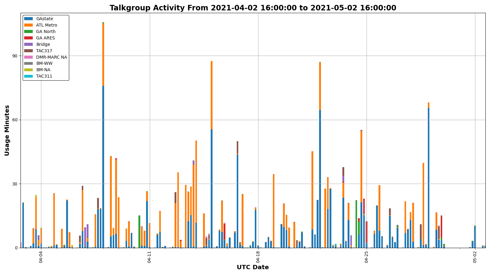

# cbridge-listener
cbridge listener is a tool that scrapes the "call watch" web service of a C-Bridge and collects information about the usage.

it is a toy I made, initially to collect and sort contact data to manually load into my XPR radios.  Once I started collecting data,
I decided I could crunch it a little more, so the tool grew kind of organically to add some new features, for instance

* usage by talkgroup by repeater
* usage by user by repeater by talkgroup
* a usage chart
* exported contacts list in N0GSG and MotoContacts formats
* a web page with repeaters and talk groups.  Note that this comes from static data, but the script compares
the static data with the collected data and issues a warning if there are talkgroups found in the collected
data that are not listed in the hardcoded dicts for each repeater.  Kinda clunky.
* web reports for repeater and user usage, live at https://www.n1kdo.com/dmr_data

I'd make this public if it wasn't so damned *ugly*.

